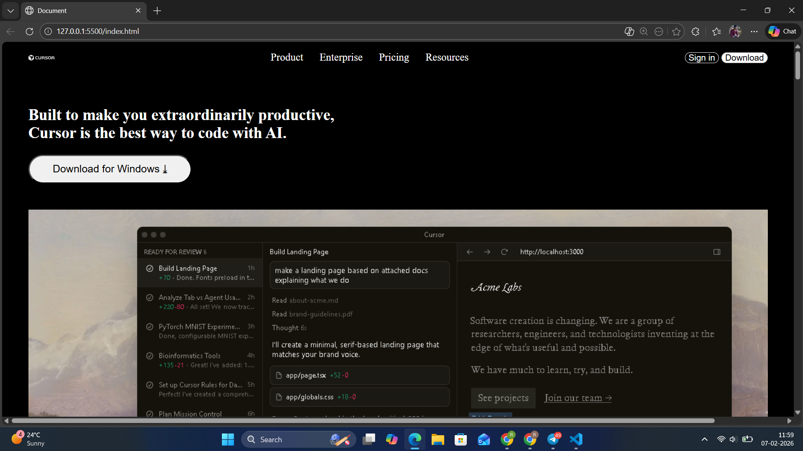
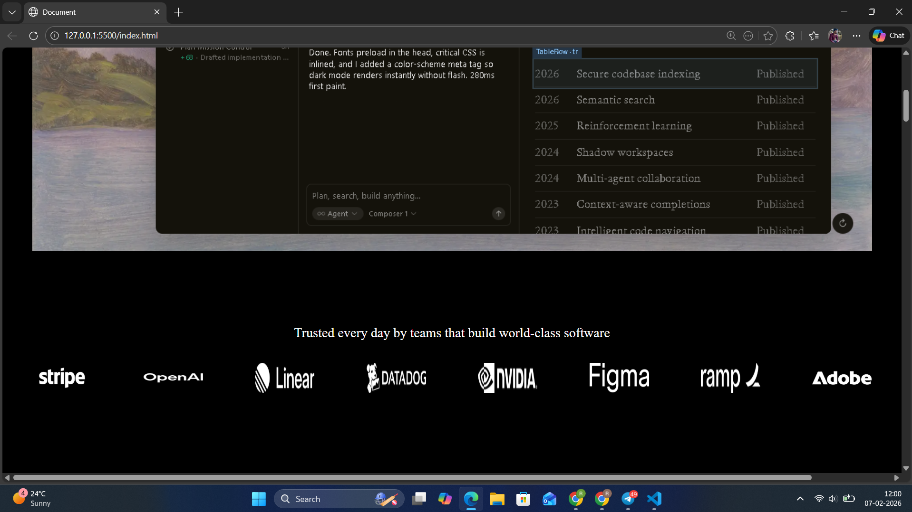
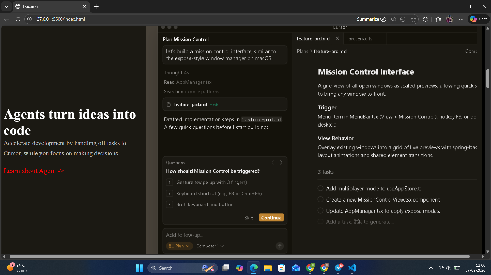
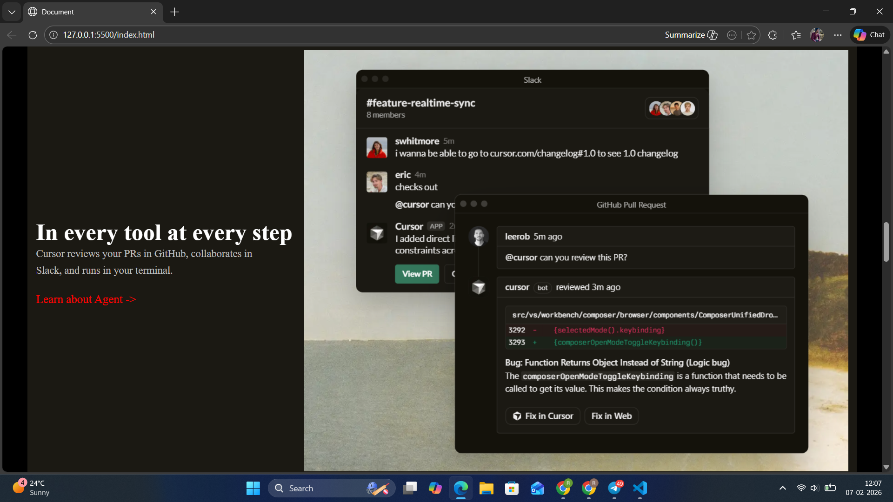
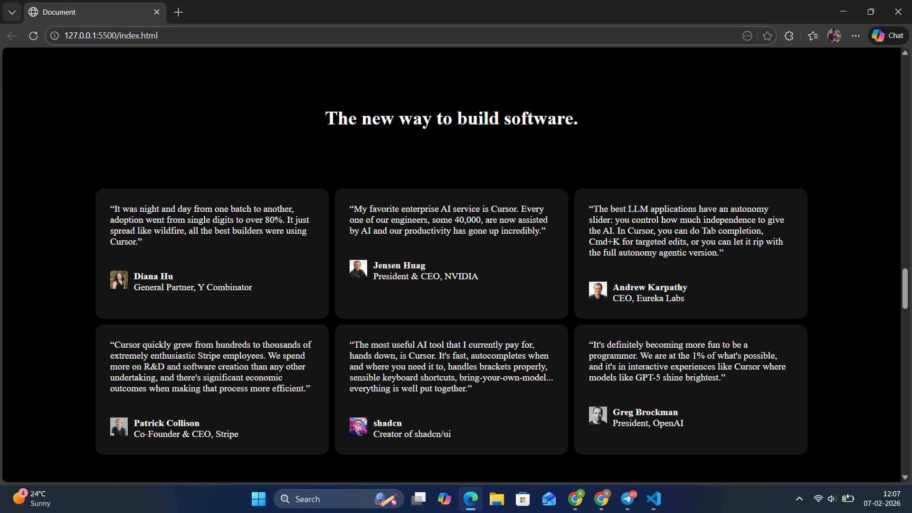
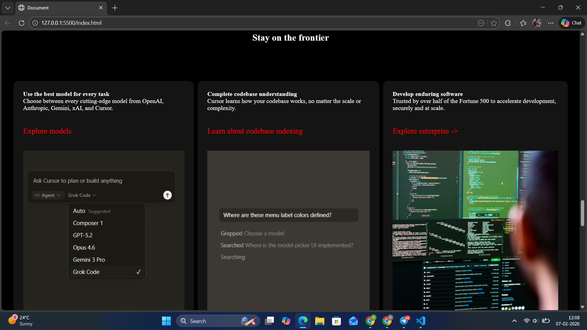
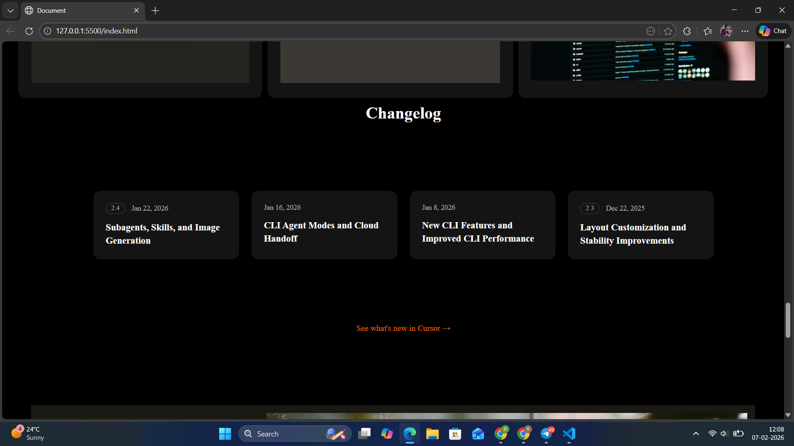
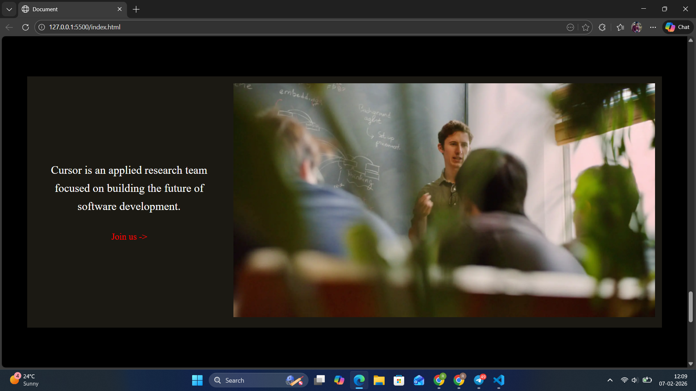
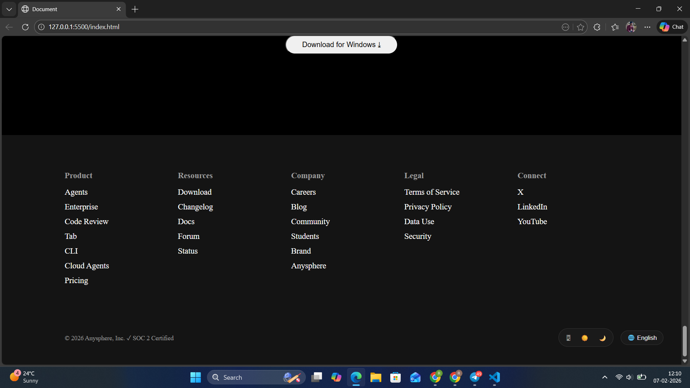

# Cursor Website Clone

This project is a front-page recreation of the Cursor website using HTML and CSS.

## Sections Recreated
- Navigation bar
- Hero section
- Trusted companies section
- Feature sections (Agents, Autocomplete, Integrations)
- Testimonials
- Changelog section
- Footer

## Technologies Used
- HTML5
- CSS3 (Flexbox & Grid)

## Screenshots

### Hero & Navigation

### Product Preview

### Trusted Companies

### Features – Agents

### Features – Autocomplete & Integrations

### Testimonials

### Stay on the Frontier

### Changelog

### Company / Join Us

### Footer

## Live Demo
[https://your-username.github.io/cursor-website-clone/](https://rahulsh05.github.io/cursor-website/)

